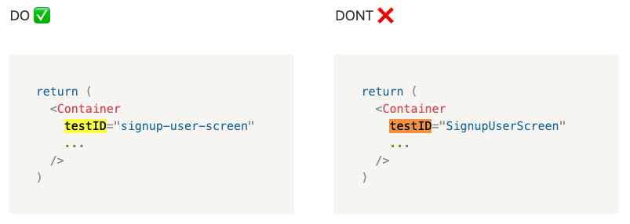

# @getluko/eslint-plugin-mobile-guidelines

## Installation

```
yarn add @getluko/eslint-plugin-mobile-guidelines --dev
```

## Configuration

`.eslintrc.js`

```
module.exports = {
  plugins: ['@getluko/eslint-plugin-mobile-guidelines'],
  rules: {
    '@getluko/mobile-guidelines/lower-dash-case-test-id': 1,
  }
```

## Rules

- @getluko/mobile-guidelines/lower-dash-case-test-id

This rule is used to enforce a naming convention on testID props



Can be autofixed = yes
